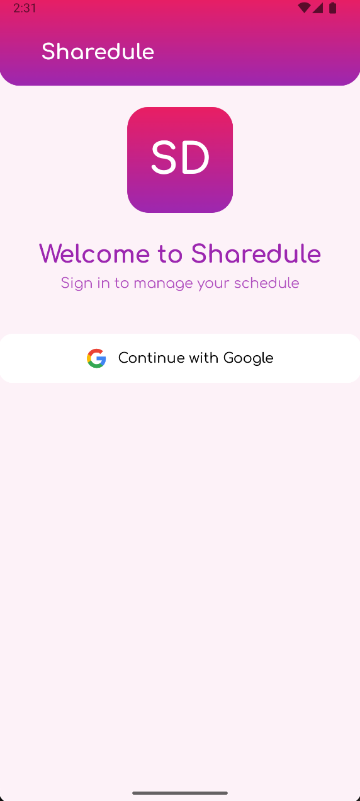
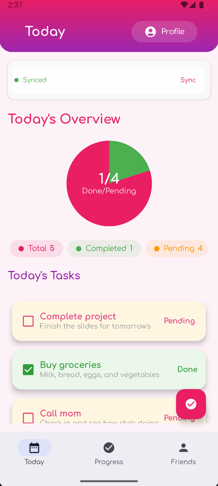
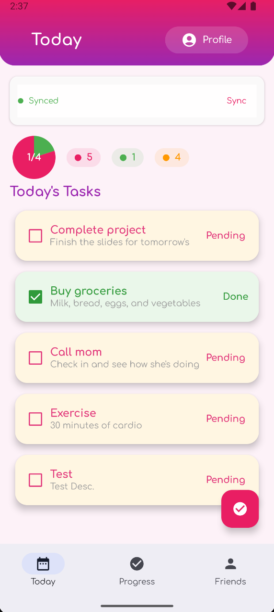
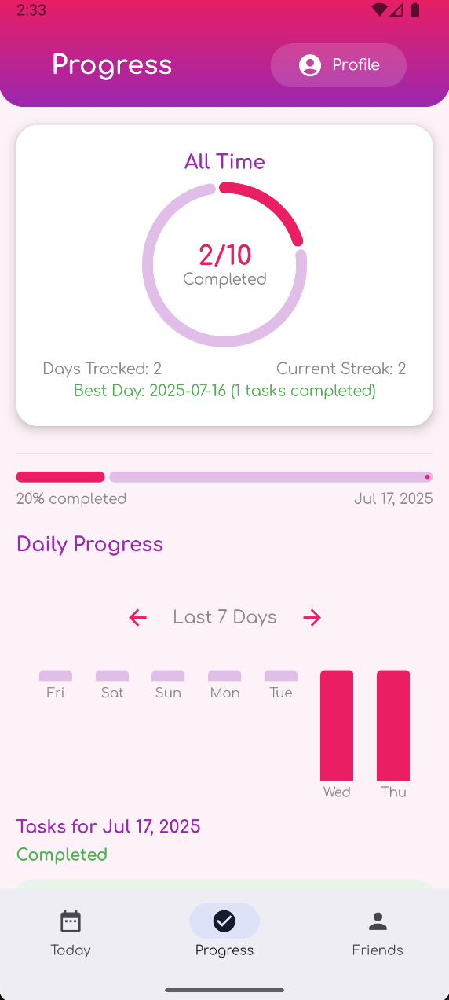
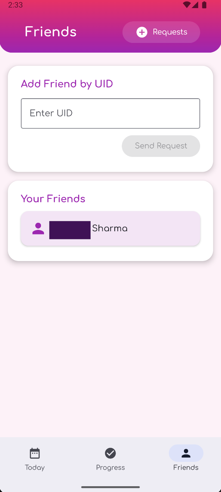
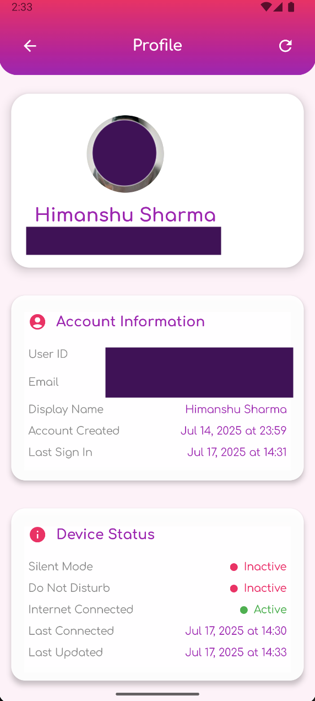

# Sharedule App

Sharedule is your personal productivity companion, designed to help you organize your daily life, achieve your goals, and stay connected with friends for mutual motivation. Here’s what you can do with Sharedule:

## App Functionalities & Features

### 1. Daily Task Management
- **Create Tasks:** Add new tasks for today or upcoming days, specifying details like title, description, and due date.
- **Edit & Delete Tasks:** Update or remove tasks as your plans change.
- **Task Completion:** Mark tasks as complete with a single tap, helping you track your accomplishments.
- **Recurring Tasks:** Set tasks to repeat daily for habits or ongoing responsibilities.

### 2. Progress Tracking
- **Daily Progress Overview:** Instantly see how many tasks you’ve completed today and what’s left.
- **Visual Progress Indicators:** Progress bars and charts help you visualize your productivity and stay motivated.
- **History:** Review your past days to see trends and celebrate your consistency.

### 3. Friend System
- **Add Friends:** Connect with friends by sending and accepting friend requests.
- **View Friends’ Progress:** See your friends’ daily progress and completed tasks (with their permission), fostering healthy competition and encouragement.
- **Friend Details:** Tap on a friend to view their profile and shared achievements.

### 4. Notifications & Reminders
- **Task Reminders:** Get timely notifications so you never forget an important task.
- **Friend Activity Alerts:** Receive updates when friends complete tasks or send you requests, keeping you engaged and connected.

### 5. User Profile
- **Personalize Your Profile:** Set your name, profile picture, and other details.
- **View Achievements:** Track your milestones and personal bests within the app.

### 6. Secure & Simple Login
- **Easy Sign-In:** Log in quickly and securely to access your personalized task list and friend network.

## Why Use Sharedule?
- **Stay Organized:** Never lose track of your daily responsibilities.
- **Boost Motivation:** Visual progress and friendly competition help you stay on track.
- **Connect & Collaborate:** Achieve more together by sharing progress and supporting friends.
- **Celebrate Success:** Track your achievements and build lasting habits.

---

## App Screenshots

### Login Screen

### Today's Tasks
<table><tr>
<td></td>
<td></td>
</tr></table>

### Daily Progress

### Friends List

### Profile

---

Sharedule is designed for anyone who wants to be more productive, stay accountable, and enjoy the journey of self-improvement with friends. Start organizing your day and achieving your goals with Sharedule! 